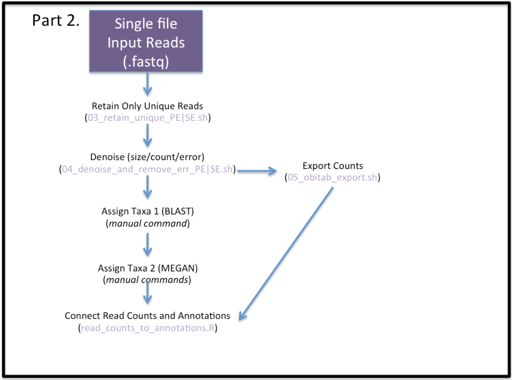

# eDNA_metabarcoding
This repo has been developed at the Molecular Genetics Laboratory of Pacific Biological Station (Fisheries and Oceans Canada). This pipeline was developed for the purposes of analyzing eDNA and other metabarcoding datasets for the projects within this lab, and carries **no guarantees of functionality or usefulness for broader/other applications**.         

**Please note: this pipeline is not currently being actively maintained**

Dependencies:    
`OBITools` (v.1) http://metabarcoding.org/obitools/doc/welcome.html       
`MEGAN 6 (CE)` https://ab.inf.uni-tuebingen.de/software/megan6     
`blastn` https://blast.ncbi.nlm.nih.gov/Blast.cgi?CMD=Web&PAGE_TYPE=BlastDocs&DOC_TYPE=Download     
`cutadapt` http://cutadapt.readthedocs.io/en/stable/     
`R` https://www.r-project.org/           
`parallel` https://www.gnu.org/software/parallel/     

**Please note: this pipeline was designed for OBITools 1, and not for any future iterations of OBITools.**

To make obitools available everywhere, add both the obitools binary and the obitools `/export/bin` folder to your path.     

Before starting, launch OBITools from the terminal    
`obitools`    

This pipeline can handle the following datatypes. To find the appropriate pipeline, see Figure 1:     
* single-end (SE) or paired-end (PE) data      
* demultiplexed or multiplexed samples in fastq.gz format     
* multiple amplicons within a single sample file     


**Figure 1.** eDNA_metabarcoding workflow, showing the different options for the first part of the pipeline to analyze the datatypes listed above. The grey box pipelines are variants derived from the standard multiplexed workflow, which is currently more stable.     

### Prepare Raw Data
Copy raw data into `02_raw_data`, decompress, then run fastqc to view quality.    

```
cd 02_raw_data     
for i in $(ls *.fastq.gz ) ; do gunzip -c $i > ${i%.gz} ; done
cd ..
mkdir 02_raw_data/fastqc_output    
fastqc -o 02_raw_data/fastqc_output 02_raw_data/*.fastq    
multiqc -o 02_raw_data/fastqc_output/ 02_raw_data/fastqc_output    
```

#### Optional: needs update
If you want to account for the number of reads in the input fastq files, producing some basic statistics on the reads (e.g. mean, sd, etc.), use the following:      
`./01_scripts/account_reads.sh`      
...followed by the Rscript run interactively:     
`./01_scripts/account_reads.R`      
For accounting reads when planning to do read merging or when having multiple amplicons in each fastq file, wait to do read accounting until later in the pipeline.    
#### end Optional: needs update


### Prepare Interpretation File
The interpretation (interp) file must be made for each sequencing lane or chip separately.      
Use `00_archive/interp_example.txt` as a template to prepare the interp.            
**Importantly**, name interp file with input fastq name, replacing the section `R[1/2]_001.fastq` with `interp.txt`    
e.g. `Lib1_S1_L001_R1_001.fastq`, `Lib1_S1_L001_R2_001.fastq`, `Lib1_S1_L001_interp.txt`       


## Part 1A. Enter Pipeline - Multiplexed Samples
This section treats fastq files that contain more than one sample.     

### 1A.1.a. PE Data: Merge Reads 
Paired-end data will undergo read merging first using illuminapairedend with a minimum score of 40. Output will be per file in the `03_merged` folder.    
`01_scripts/01a_read_merging.sh`     

Retain only the merged (also termed 'aligned') reads using obigrep:     
`01_scripts/01b_retain_aligned.sh`     

#### Post-Merge Read Accounting       
The following script will account reads and merges:      
`01_scripts/check_merging.sh`      
...followed by Rscript interactively:      
`01_scripts/read_and_alignment_summary.R`      

### 1A.1.b. SE Data: Rename Files
If you have SE data, this is necessary to match the file names from PE data for the pipeline, run for each fq file:       
`cp -l 02_raw_data/your_file_R1_001.fastq 03_merged/your_file_ali.fq`    


### 1A.2. Separate Individuals   
Use ngsfilter with the interp file(s) to demultiplex samples out of the `*.ali.fq` file(s). Results will be separated by sample and placed in `04_samples`.     
`./01_scripts/02_ngsfilter.sh`    

Audit: how many reads were assigned to a sample?   
`for i in $(ls 04_samples/*_ali_assi.fq) ; do echo $i ; grep -cE '^\+$' $i ;  done`   

Since all files should now be annotated with a sample ID in the fasta record header, one can concatenate all files together:  
```
mkdir 04_samples/sep_samples
mv 04_samples/*.fq 04_samples/sep_samples
cat 04_samples/sep_samples/*_ali_assi.fq > 04_samples/all_files_ali_assi.fq
```

Move on to [Part 2](#part-2-main-analysis).

## Part 1B. Enter Pipeline - De-Multiplexed Data Variants
This section treats fastq files that are already de-multiplexed.   
Depending on the data type (see Figure 1), the steps taken here will vary (also see Variant A and Variant B).        

### Variant A. De-multiplexed single-amplicon (SE and PE)
### 1B.0. Cutadapt
Barcodes are not used to de-multiplex here, but the primer sequence still must be removed. Set the primer variables in the following script and run it to produce your fastq files without the primer renamed as 'yourfile_noprime.fastq'.     
`01_scripts/00_cutadapt_primer_seq.sh`    

### 1B.1.a. PE Reads: Merge
Similar to above, merge PE reads on the primer-removed fastq files:        
`01_scripts/01a_read_merging_noprime.sh`    
`01_scripts/01b_retain_aligned.sh`    

Now move all of your merged, individual 'ali.fq' into the appropriate folder:       
`cp -l 03_merged/*ali.fq 04_samples/`     
Note: there should only be the files in 04_samples that you are looking to move forward in the pipeline.     

As ngsfilter was not used here, before combining multiple samples together, we need to annotate each read with a sample ID. This is conducted with the following script that will use obiannotate to name records, then combine all into `04_samples/*merged_data_assi.fq`        
To do this, run: `01_scripts/obiannotate_ident_generalized.sh`      

Now move on to [Part 2](#part-2-main-analysis).

### 1B.1.b. SE Reads: Prepare Data for Obitools
To get into the pipeline, with reads formatted for obitools, use a pass through ngsfilter designed to fail all reads, then take all unidentified reads for your sample and move forward.     
`01_scripts/02_ngsfilter_SE_exp_unident.sh`    
All the data should be in 'unidentified' files per sample, and all 'assigned' files should be empty here.    

Each read will then be annotated with a sample ID, then all files combined together:    
`01_scripts/obiannotate_unident.sh`

To identify identical amplicons, cut SE data down to a uniform size (230 bp) with cutadapt:      
`cutadapt --length 230 -o 04b_annotated_samples/merged_data_assi_230.fq 04b_annotated_samples/merged_data_assi.fq`      
Move on to [Part 2](#part-2-main-analysis).

### Variant B. De-multiplexed multiple-amplicon (SE option only)
SE data will enter the obitools pipeline by using ngsfilter with the primer sequence for the sample split into the first six basepairs as a fake 'barcode' and the last sequence of the primer as the primer sequence. This way you can, per sample, de-multiplex your data by amplicon type. Note that this runs on the raw fastq data, so is a slight variant from the typical ngsfilter in other pipelines.     
`01_scripts/02_ngsfilter_18S_for_separating_amplicons.sh`    

Per sample, the data can be split into the two amplicon types (it is currently just named in the accession):   
`01_scripts/00b_split_by_type.sh`    
Note here that this script will need to be edited for your use. Currently uses grep to take the following three lines after the identifier of interest.    

Do the rest separately for your two amplicon types.    
As above, use obiannotate to annotate your sequences.      
`01_scripts/obiannotate_ident.sh`     

After completing this step, one can use the following scripts to account for reads from each amplicon type:     
`01_scripts/account_reads_annot.sh`     
`02_scripts/account_reads_annot.R`      

Move on to [Part 2](#part-2-main-analysis).

## Part 2. Main Analysis 


### 2.1. Retain Only Unique Reads
Input is a single fastq file containing all samples for a specific amplicon, annotated in the fastq accession with sample name.   

Use obiuniq to keep one record per unique amplicon, retaining the count number (outputs fasta):   
For paired-end data: `./01_scripts/03_retain_unique_PE.sh`      
For single-end data: `./01_scripts/03_retain_unique_SE.sh`     
Note: one can also edit this script to add other -m flags, such as `run`, or `pcr_rep`, etc., anything that you may want to summarize over using obitab later.    

Audit: sum up the count value to make sure all reads are accounted for:    
`grep -E '^>' 04_samples/your_file_ali_assi_uniq.fa | awk -F'\ count=' '{ print $2 }' - | awk -F';' '{ print $1 }' | paste -sd+ - | bc`

Audit: look at the distribution of counts   
`grep -E '^>' 04_samples/your_file_ali_assi_uniq.fa | awk -F'\ count=' '{ print $2 }' - | awk -F';' '{ print $1 }' | sort -nr | less`

### 2.2. Denoise by Filtering by Size, Count, and PCR/Seq Error
Use obigrep to only retain reads within a specified size range and minimum count. Then use obiclean to only keep the head (H) or singleton (S) amplicons, not the internals (I) (slight deviations from the head). Currently using `r=0.5`    

PE data does full filtering as above:    
`./01_scripts/04_denoise_and_remove_err.sh` (edit LMIN, LMAX, MIN_READS)    

SE data filters only on size and count:    
`./01_scripts/04_denoise_and_remove_err_SE.sh` (edit LMIN, LMAX, MIN_READS)    
    

Audit: determine how many reads make it through each filtering steps:    
Reads in the fasta after size selecting/count filter:   
`grep -E '^>' 04_samples/*_ali_assi_uniq_c10_55-75.fa | awk -F"\ count=" '{ print $2 }' - | awk -F";" '{ print $1 }' - | paste -sd+ - | bc`     

Note: can also test other lengths by streaming into grep: 
`obigrep --lmin 55 --lmax 75 -p 'count>=5' 04_samples/yourfile.fa | grep -cE '^>' - `

### 2.3. Export data     
Use obitab to output a tab-delimited text file that will be used as an input to the R Script below.   
`./01_scripts/05_obitab_export.sh`    

### 2.4. Assign each sequence to a taxon
Use a blastn to align the H and S fasta file against nt (NCBI remote).   
`blastn -db nt -query 04_samples/your_cleaned_HS.fa -out 05_annotated/your_lib_output.txt -remote -num_descriptions 10 -num_alignments 10`    

Or if running a large set of queries, use parallel:   
`SEQUENCE_FILE="04_samples/your_filtered_fasta.fa" ; OUTPUT="05_annotated/your_filtered_fasta_hits.txt" ; cat $SEQUENCE_FILE | parallel -j 12 -k --block 1k --recstart '>' --pipe 'blastn -db /home/ben/blastplus_databases/nt -query - -num_descriptions 10 -num_alignments 10 ' > $OUTPUT`    

Track output:    
`grep -cE 'Query= ' 05_annotated/your_filtered_fasta_hits.txt`

Note: for MEGAN, the blast output must be standard output format, not outfmt.  

### 2.5. Annotate sequences with species   
Launch MEGAN, import the blast output and the fasta file used as the blast query  
Apply the following LCA settings:   
`min score 100`    
`max expected 0.00000001`   
`min % ID 97`   
`top % 10`   
`min support % 0 (off)`   
`min support 1`   

Select level of taxonomy to view, possibly use multiple different levels, e.g. species, genus, family       
File -> Export csv      
Choose: `readName_to_taxonName`    
Save into the folder  `05_annotated`  

### 2.6. Connect read counts and annotations    
This will use the R script `read_counts_to_annotations.R`, run interactively.   
Necessary inputs:   
Amplicon annotation output from MEGAN, and amplicon read count from `obitab`   

This script is currently highly customized to the two projects using this analysis. To change it to fit your data, you would have to provide the appropriate filenames, datatypes, locations of samples. This script would be more considered to be a template to modify for the user for other studies.    

In brief, this will merge these two inputs, attach locations, aggregate different amplicons with same annotation, calculate proportions, save out proportion plots and count/proportion tables.    

Within here, one can apply a low expression filter to remove any counts less than 10.   
Output will be saved to `06_output_figures` (for figures) and `05_annotated` (for counts/proportions).    

There is also a second script that is more customized, specifically tailored to the HABs project to deal with the Variant pipeline types `01_scripts/read_counts_to_annotations_HABs.R`. This script is not currently for broader use, and is only used for this project.       

These Rscripts may be continually developed if there is interest in increasing the generality of this pipeline. Please contact the author for more information or comments.     
