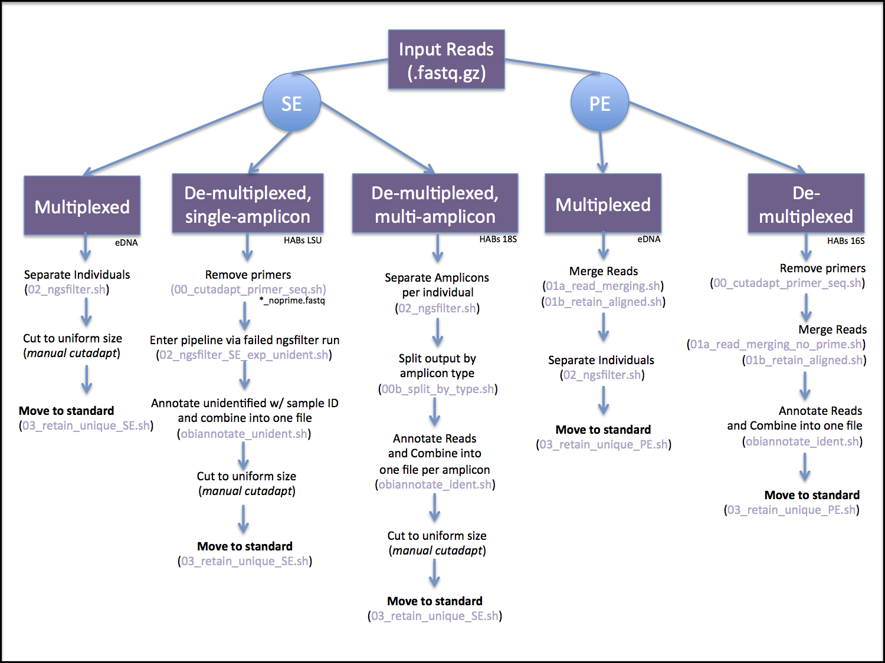

# eDNA_metabarcoding
Note: This repo is mainly for the developers purpose, no guarantees of functionality or usefulness.    

Dependencies:    
`OBITools` http://metabarcoding.org/obitools/doc/welcome.html       
`MEGAN 6 (Community Edition)` https://ab.inf.uni-tuebingen.de/software/megan6     
`blastn` https://blast.ncbi.nlm.nih.gov/Blast.cgi?CMD=Web&PAGE_TYPE=BlastDocs&DOC_TYPE=Download     
`cutadapt` http://cutadapt.readthedocs.io/en/stable/     
`R`     

To make obitools available everywhere, add the obitools binary and the obitools `/export/bin` folder to your $PATH     

Launch OBITools    
`obitools`    

This pipeline can handle the following, and to find the appropriate pipeline, see Figure 1:     
* single-end (SE) or paired-end (PE) data      
* demultiplexed or multiplexed data     
* multiple amplicons within a single sample file     


**Figure 1.** eDNA_metabarcoding workflow, showing the front end different options for either single-end (SE) or paired-end (PE) data, prior to the main analysis section. The grey box pipelines are variants derived from the standard multiplexed workflow (currently more stable).     

### Prepare raw data
Copy raw data into `02_raw_data`, decompress, then run fastqc to view quality.    

```
cd 02_raw_data     
for i in $(ls *.fastq.gz ) ; do gunzip -c $i > ${i%.gz} ; done
mkdir 02_raw_data/fastqc_output    
fastqc -o 02_raw_data/fastqc_output 02_raw_data/*.fastq    
multiqc -o 02_raw_data/fastqc_output/ 02_raw_data/fastqc_output    
```

### 00. Prepare the interpretation files
Note: This must be done for each sequencing lane or chip separately. Use `00_archive/interp_example.txt` as a template.            

**Importantly**, name the interpretation file with the input fastq name, but replace `R[1/2]_001.fastq` with `interp.txt`    
e.g. `Lib1_S1_L001_R1_001.fastq`, `Lib1_S1_L001_R2_001.fastq`, `Lib1_S1_L001_interp.txt`       


## Part 1a. Prepare input data - Multiplexed Data
Depending on the data type (see Figure 1), the steps taken here will vary.

### 01. Merging Paired-End Reads 
Paired-end data will undergo read merging first:    
`01_scripts/01a_read_merging.sh`     
(essentially: `illuminapairedend --score-min=40 -r R2.fq R1.fq > output.fq`)      
Then retain only the merged (aligned) reads:     
`01_scripts/01b_retain_aligned.sh`     
(essentially: `obigrep -p 'mode!="joined"' input.fq > output.fq`)   

How many reads remain after keeping only merged?     
`grep -cE '^\+$' 03_merged/*ali.fq`

Single-end data is not merged, skip to [Separate Individuals](#separate-individuals-se-start).    

### 02. Separate Individuals (SE start)   
If you are using single-end data, match the output of initial PE steps:   
`cp -l 02_raw_data/your_file_R1_001.fastq 03_merged/your_file_ali.fq`    

Use ngsfilter with your interp files to separate individuals out of the `*.ali.fq` file.     
`./01_scripts/02_ngsfilter.sh`    
(essentially: `ngsfilter -t your_interp.txt -u unidenfied.fq input.fq > output_ali_assi.fq`)    

How many reads were assigned to a sample?   
`for i in $(ls 04_samples/*assi.fq) ; do echo $i ; grep -cE '^\+$' $i ;  done`   

If each output file is annotated with the sample ID, you can concatenate the files all together:     
```
mkdir 04_samples/sep_indiv
mv 04_samples/*.fq 04_samples/sep_indiv
cat 04_samples/sep_indiv/*_ali_assi.fq > 04_samples/all_files_ali_assi.fq
```

Next will be Part 2. 

## Part 1b. Prepare input data - De-multiplexed data
This section is the preparation of input data section if your data comes de-multiplexed. Depending on the data type (see Figure 1), the steps taken here will vary.  

### 01. De-multiplexed single-amplicon (SE and PE)
Remove the primers from the reads:   
`01_scripts/00_cutadapt_primer_seq.sh`    
(essentially: cutadapt (#show options#))


Paired-end data, merge reads and only keep those that merge:   
`01_scripts/01a_read_merging_no_prime.sh`    
`01_scripts/01b_retain_aligned.sh`    

Paired-end data, annotate reads with the sample ID, then combine all read files into one:    
`01_scripts/obiannotate_ident.sh`

Paired-end data can then move to Part 2.   


Single-end data, enter the obitools pipeline via a failed run of ngsfilter and take all of the 'unidentied reads' per sample as your sample's reads:    
`01_scripts/02_ngsfilter_SE_exp_unident.sh`    

Single-end data, annotate reads with sample ID, then combine all read files into one:     
`01_scripts/obiannotate_unident.sh`

Cut the single end data to a uniform size, which improves the identification of non-unique amplicons, using cutadapt:  `cutadapt --length 230 -o 04b_annotated_samples/merged_data_assi_230.fq 04b_annotated_samples/merged_data_assi.fq`      
Single-end data can then move to Part 2. 

### 02. De-multiplexed multiple-amplicon (SE option only)
(#todo from HABs 18S) 

## Part 2. Analysis 
### 01. Retain Only Unique Reads
Use obiuniq to keep one record per unique amplicon in the fastq (outputs fasta).   
For paired-end data: `./01_scripts/03_retain_unique_PE.sh`      
For single-end data: `./01_scripts/03_retain_unique_SE.sh`     
(essentially: `obiuniq -m sample input.fq > output_uniq.fa`)        
One can also add other -m flags, such as `run`, or `pcr_rep`, etc., anything that you may want to summarize over using obitab later.    

Optional: sum up the count value to make sure all reads are accounted for:    
`grep -E '^>' 04_samples/NGSLib1_ali_assi_uniq.fa | awk -F'count=' '{ print $2 }' - | awk -F';' '{ print $1 }' | paste -sd+ - | bc`

Optional: look at the distribution of counts   
`grep -E '^>' 04_samples/NGSLib1_ali_assi_uniq.fa | awk -F'count=' '{ print $2 }' - | awk -F';' '{ print $1 }' | sort -nr | less`


CURRENTLY UPDATED TO HERE 


### 04. Denoise (size and count) and remove putative seq/pcr errors
Use obigrep to only retain reads within a specified size range and minimum count. Then use obiclean to only keep the head (H) or singleton (S) amplicons, not the internals (I) (slight deviations from the head). Currently using `r=0.5`    
    
Edit the following script to set the `LMIN`, `LMAX` and `MIN_READS` variables, then run it.  
`./01_scripts/04_denoise_and_remove_err.sh`    

Essentially, altogether this does: 
```
obigrep --lmin <min> --lmax <max> -p 'count>= <min.reads>' input.fa > output.fa     
obiclean -s merged sample -r 0.05 output_obigrep.fa > output_obiclean.fa   
obigrep -a 'obiclean_status:s|h' output_obiclean.fa > output_all.fa
```

Personal suggested uses:   
Valentini primers=55-75    
Other longer amplicons=100-300      

To help determine how many reads make it through each filtering steps, you can use the following commands.    
For the reads in the fasta after size selecting and count filter:   
`grep -E '^>' 04_samples/*_ali_assi_uniq_c10_55-75.fa | awk -F"count=" '{ print $2 }' - | awk -F";" '{ print $1 }' - | paste -sd+ - | bc`     
For the reads in the fasta after only keeping head and singletons:
`grep -E '^>' all_files_ali_assi_uniq_c10_55-75_clean_HS.fa | awk -F"; count=" '{ print $2 }' - | awk -F";" '{ print $1 }' - | paste -sd+ - | bc`    


Optional: can also test other lengths by streaming into grep: 
`obigrep --lmin 55 --lmax 75 -p 'count>=5' 04_samples/yourfile.fa | grep -cE '^>' - `

The final output of this script will be used as an input to the BLAST query below.   
Note: one can try different count parameters, for example, and can run it within the existing directory.    

## 05. Export data     
Use obitab to output a tab-delimited text file that will be used as an input to the R Script below.   
`./01_scripts/05_obitab_export.sh`    
Essentially: `obitab --output-seq input.fa > output.txt`   


## 06. Assign each sequence to a taxon
Use a blastn to align the H and S fasta file against nt (NCBI remote).   
`blastn -db nt -query 04_samples/your_cleaned_HS.fa -out 05_annotated/your_lib_output.txt -remote -num_descriptions 10 -num_alignments 10`    

Note: for MEGAN, the blast output must be standard output format, not outfmt.  

## 07. Annotate sequences with species   
Launch MEGAN, import the blast output and the fasta file used as the blast query  
Apply the following LCA settings:   
`min score 100`    
`max expected 0.00000001`   
`min % ID 97`   
`top % 10`   
`min support % 0 (off)`   
`min support 1`   

Select level of taxonomy to view, possibly use multiple different levels, e.g. species, genus, family       
File -> Export csv      
Choose: `readName_to_taxonName`    
Save into the folder  `05_annotated`  

## 08. Connect read counts and annotations    
This will use the R script `read_counts_to_annotations.R`, run interactively.   
Necessary inputs:   
Amplicon annotation output from MEGAN, and amplicon read count from `obitab`   

In brief, this will merge these two inputs, attach locations, aggregate different amplicons with same annotation, calculate proportions, save out proportion plots and count/proportion tables.    

Within here, one can apply a low expression filter to remove any counts less than 10.   
